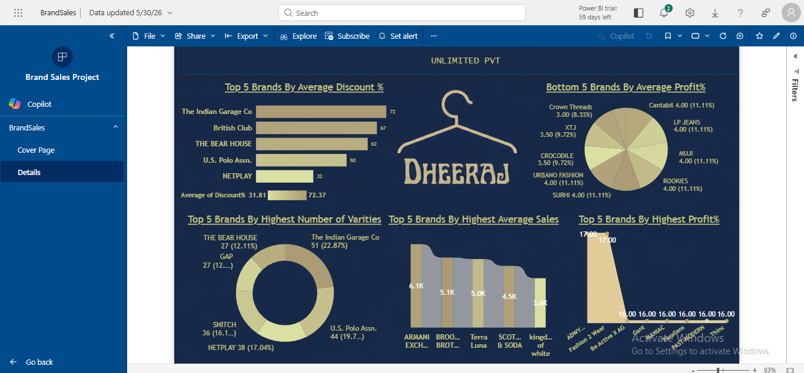

# Brand Sales Analysis Dashboard

## Project Link

https://app.powerbi.com/Redirect?action=OpenApp&appId=60a73c94-8760-4d90-ab59-29ea0c2de0c2&ctid=98f2531c-ef28-4c7d-a0bb-68624c1fdcc0&experience=power-bi

## 📌 Project Overview

The **Brand Sales Analysis Dashboard** is an interactive Power BI dashboard designed to analyze brand performance across multiple business metrics. It provides insights into sales, profit, discount percentages, and product variety, helping users identify top-performing and underperforming brands.

---

## 📊 Dashboard Highlights

### Top 5 Brands by Average Discount %

Displays the brands offering the highest average discounts.

**Brands Identified:**

* The Indian Garage Co
* British Club
* THE BEAR HOUSE
* U.S. Polo Assn.
* NETPLAY

---

### Bottom 5 Brands by Average Profit %

Highlights brands with the lowest average profit percentages.

**Brands Identified:**

* Crown Threads
* XTJ
* CROCODILE
* URBAN FASHION
* SURHI
* LP JEANS
* MUJI
* ROOKIES
* Cantabil

---

### Top 5 Brands by Highest Number of Varieties

Shows brands with the widest product assortment.

**Brands Identified:**

* The Indian Garage Co
* U.S. Polo Assn.
* NETPLAY
* SNITCH
* GAP
* THE BEAR HOUSE

---

### Top 5 Brands by Highest Average Sales

Displays brands generating the highest average sales.

**Brands Identified:**

* ARMANI EXCHANGE
* BROOKS BROTHERS
* Terra Luna
* SCOTT & SODA
* kingdom of white

---

### Top 5 Brands by Highest Profit %

Highlights brands with the highest profit percentages.

**Brands Identified:**

* ADWY...
* Fashion 2 Wear
* Be Active X AG
* Gant
* ACMANIAC
* Pantaloons
* MODERN
* Titnc

---

## 🎯 Key Insights

* Compare brand performance based on sales, profit, discounts, and product variety.
* Identify brands offering the highest discounts.
* Discover brands generating the highest average sales.
* Analyze profit contribution across different brands.
* Evaluate product assortment and variety distribution.

---

## 🛠️ Tools Used

* **Power BI** – Dashboard Development & Visualization
* **Data Modeling** – Relationship Management
* **DAX** – Measures and Calculated Metrics
* **Data Cleaning & Transformation** – Power Query

---

## 📷 Dashboard Preview



---

## 🚀 Features

* Interactive dashboard navigation
* Brand-wise performance analysis
* Sales and profit comparison
* Discount trend visualization
* Product variety distribution analysis
* Clean and user-friendly dashboard layout

---

## 📁 Project Structure

```text
Brand-Sales-Analysis/
│
├── BrandSales.pbix
├── README.md
└── Dashboard_Screenshot.png
```
